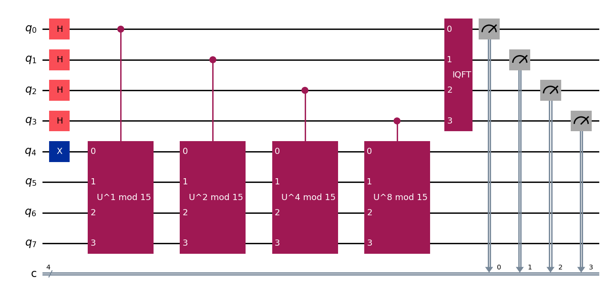

# Simulating Shor's Algorithm to Break RSA Encryption

This project simulates Shor’s algorithm using Qiskit to demonstrate how RSA encryption could, in theory, be broken by quantum computer. 

Since **order finding(period estimation)** is the key quantum step in breaking RSA, this project focuses on how a quantum computer can estimate the period `r` (order `r`) of a number `a mod n`  The implementation includes:

- Modular exponentiation as a unitary gate
- Quantum Phase Estimation (QPE)
- Visualization of circuit behavior for small composite numbers (e.g, `n = 15`)
- Discrepancy (Limitation of QPE)
- [Optional] Comparison: Classical vs. Quantum order finding
- [Optional] Classical post-processing to factor `n` using the found order `r`
- Limitation and Final thoughts
 
The goal is to illustrate the **quantum speedup** enabled by QPE in Shor's algorithm. 
An optional section shows how full RSA factorization could proceed once the period is known.

⚠️ Due to current hardware limitations, this simulation only works with very small values (e.g., n = 15).

 

**Figure 1:** *QPE-based circuit for estimating the order r of a mod n. (here `2 mod 15`)*

  

**Figure 2:** *Bar-chart of measurement outcomes after 3200 shots of the QPE circuit*

 

---

📢 **Extra**: I shared this project on LinkedIn to reflect on the learning process and connect with others interested in quantum computing.

🔗 [View the post on LinkedIn](https://www.linkedin.com/feed/update/urn:li:activity:7340649451797061632/)

---

📝 **Academic Integrity Disclaimer**

This notebook was developed as part of my final exam project for the course **PGR213: Programming and Quantum Computing** at Kristiania University of Applied Sciences (Spring 2025). 

It is shared publicly for portfolio and personal learning purposes only. 
**Please do not copy or submit this work as your own** if you are currently taking or planning to take this course. 

